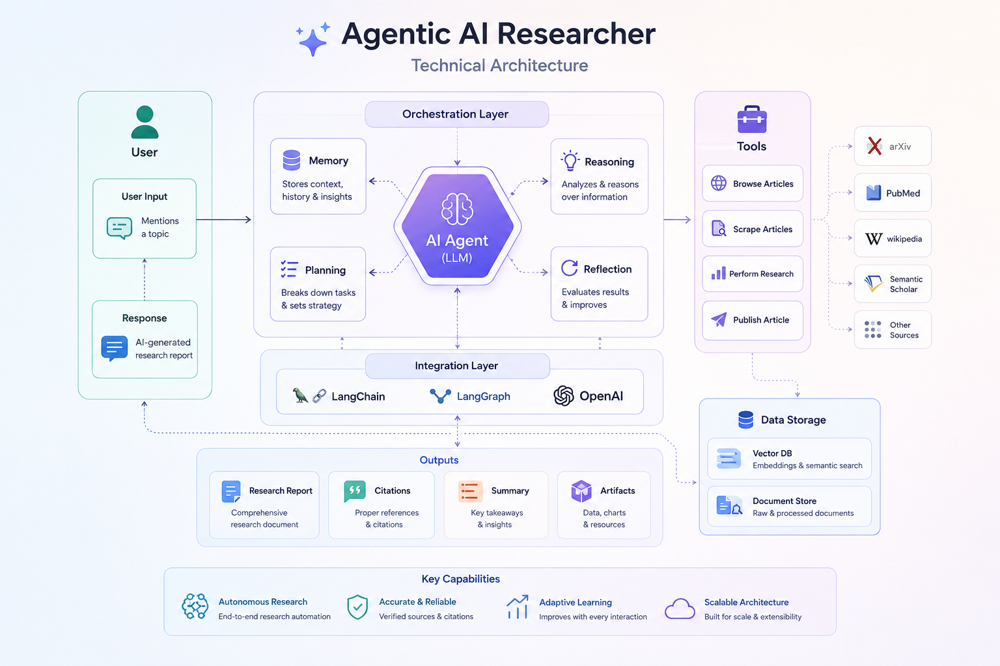

# 🔬 Research Paper Workflow with LangGraph



> An AI-powered pipeline that searches arXiv, reads PDFs, generates research ideas, writes LaTeX papers, and renders them to PDF — all through a conversational interface.

---

## ✨ Features

| Feature | Description |
|---|---|
| 📡 **ArXiv Search** | Fetch and list recent papers by topic |
| 📄 **PDF Reader** | Summarize contributions and future directions |
| 💡 **Idea Generator** | Produce concise, numbered research ideas |
| 🖊️ **LaTeX Writer** | Generate valid LaTeX code for a new paper |
| 📤 **PDF Renderer** | Export the final paper as a downloadable PDF |

---

## 📂 Project Structure

```
.
├── tools_dir/
│   ├── arxiv_tool.py      # Searches arXiv for papers by topic
│   ├── read_pdf.py        # Downloads and summarizes PDFs
│   └── write_pdf.py       # Renders LaTeX code into a PDF
├── main.py                # Entry point — defines and runs the LangGraph workflow
├── diagram.png            # Visual graph of the agent workflow
├── .env                   # API keys (not committed to git)
├── requirements.txt       # Python dependencies
└── README.md
```

---

## ⚙️ Setup

### 1. Clone & Install

```bash
git clone https://github.com/your-username/your-repo.git
cd your-repo
pip install -r requirements.txt
```

### 2. Configure Environment

Create a `.env` file in the project root:

```env
OPENAI_API_KEY=your_openai_key_here
MISTRAL_API=your_mistral_key_here
```

### 3. Run

```bash
python main.py
```

---

## 🧑‍💻 Usage

The agent is fully conversational. Here's a typical end-to-end session:

**Step 1 — Search for papers**
```
User: I want to write a paper on LLMs
```
→ Returns a numbered list of recent arXiv papers with IDs and links.

**Step 2 — Read a paper**
```
User: Read paper 2506.12345
```
→ Summarizes contributions and future directions in bullet points.

**Step 3 — Generate research ideas**
```
User: Give me research ideas
```
→ Returns concise, numbered ideas based on the paper read.

**Step 4 — Write the paper**
```
User: Write paper on idea 2
```
→ Outputs valid, compilable LaTeX code for the full paper.

**Step 5 — Render to PDF**
```
User: Render the LaTeX into PDF
```
→ Compiles and saves the paper as a PDF file.

---

## 📊 Workflow Architecture

The LangGraph workflow is built around three core components:

- **Agent Node** — Calls the LLM to decide the next action
- **Tool Node** — Executes one of: `arxiv_search`, `read_pdf`, or `render_latex_pdf`
- **Conditional Edges** — Routes back to tools if more actions are needed, or ends the loop

```
  [User Input]
       │
       ▼
  [Agent Node] ──── needs tool? ──── Yes ──→ [Tool Node] ──┐
       │                                                     │
       No (done)                                             │
       │                                 ◄───────────────────┘
       ▼
  [Final Response]
```

---

## 🖼️ Example Outputs

- 📋 Numbered list of arXiv paper titles with IDs and PDF links
- 📝 Bullet-point summaries of contributions and future directions
- 🔢 Concise numbered research ideas
- 📄 Full LaTeX source code ready to compile
- 📦 Rendered PDF file saved locally

---

## 🛠️ Tech Stack

- [LangGraph](https://github.com/langchain-ai/langgraph) — Agent workflow orchestration
- [OpenAI API](https://platform.openai.com/) — LLM backbone
- [Mistral API](https://mistral.ai/) — Optional model integration
- [arXiv API](https://arxiv.org/help/api/) — Paper search and retrieval

---

## 📝 Notes

- The agent is prompted to avoid filler text and return only concise, structured output.
- All tool calls are logged to the console so you can follow each step in real time.
- LaTeX output is designed to compile without errors using standard packages.

---

## 🤝 Contributing

Pull requests are welcome! For major changes, please open an issue first to discuss what you'd like to change.

---

## 📄 License

[MIT](LICENSE)